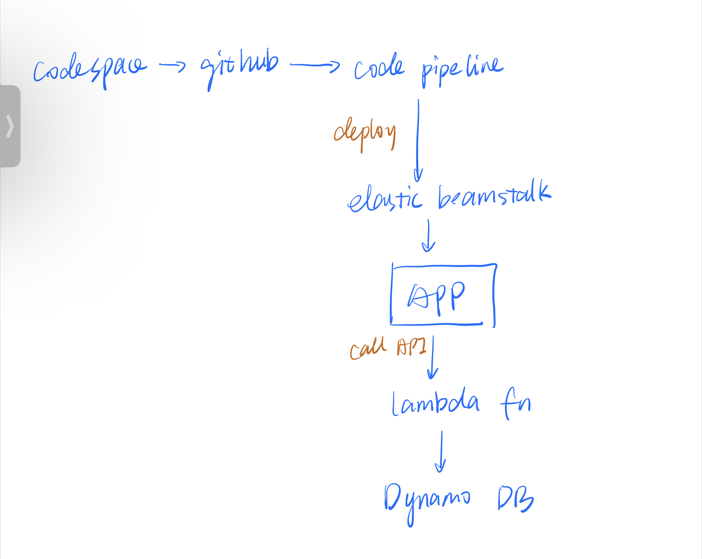

# chloeproj4

For this project, I created a simple web app using flask and deployed it with aws elastic beanstalk. I implemented the cicd pipeline by using the code pipeline in aws. Also, I used api gateway to create a restful api and trigger lambda function to store user info into dynamodb.

